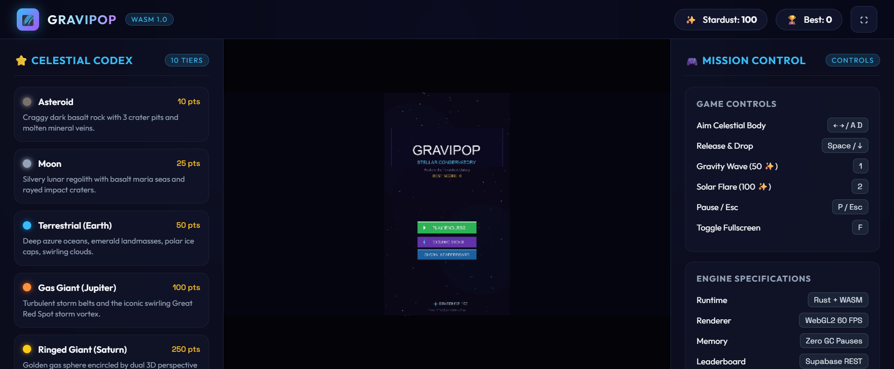
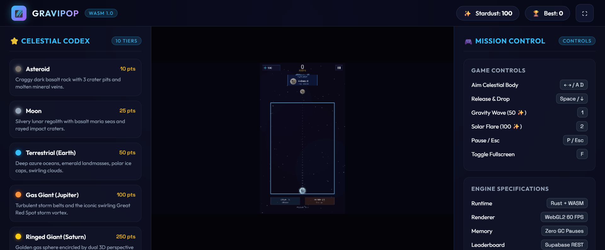

# 🌌 GraviPop: Stellar Conservatory

> **A high-performance hybrid-casual cosmic merge puzzle game built in pure Rust & WebAssembly.**
> Zero garbage collection pauses, instant sub-second cold starts, zero engine bloat, and universal compatibility across Desktop, Mobile (Android), and Web (Vite).

---

## 📸 Screenshots & Live Interface

| Modern Vite Web Application Shell | Active Cosmic Merge Gameplay |
| :---: | :---: |
|  |  |

---

## 🚀 Recent Accomplishments & System Upgrades

- **Modern Vite Web Application Shell (Resolved & Configured)**:
  - **Instant Sub-Second HMR & Dev Server**: Replaced the static server setup with a first-class **Vite** web application. Developers and players can run `npm run dev` for instant 300ms startup at `http://localhost:3000`.
  - **Zero-Friction Macroquad WASM Integration**: Eliminated the fatal `TypeError: Import #1 "__wbindgen_placeholder__"` crash caused by mixing `wasm-bindgen` with Macroquad. Implemented a clean, zero-overhead Web FFI bridge (`src/core/web_bridge.rs` & `web/gravipop_web.js`) utilizing Miniquad's native plugin architecture.
  - **Strict-Mode Loader Fix**: Fixed the upstream strict-mode `ReferenceError: register_plugin is not defined` bug in Macroquad's bundled `mq_js_bundle.js`, ensuring 100% clean browser console execution with zero errors or warnings.
  - **Ultra-Premium Cosmic Design System**: Surrounding the WebGL game canvas is a responsive glassmorphic dashboard:
    - **Celestial Codex (Left Wing)**: Live interactive cards detailing all 10 celestial tiers (Asteroid to Singularity), score yields, and cosmic lore.
    - **Mission Control (Right Wing)**: Keyboard shortcuts cheatsheet (`←`/`→`/`A`/`D`, `Space`, `1`, `2`, `P`/`Esc`, `F` for fullscreen) and live engine specifications.
    - **Header Bar**: Live synchronized Stardust balance and High Score pill trackers reading in real-time from `localStorage`.
    - **Mobile Responsive Drawers**: On mobile viewports (< 1180px), side wings gracefully tuck away into floating glassmorphic buttons so the game canvas claims 100% full-screen immersive focus.

- **Physics & Merge Engine Overhaul (100% Resolved)**:
  - **Immediate Surface Touch Merging**: Replaced interpenetration thresholds with a robust surface contact detector (`dist <= contact * 1.02`). Same-tier celestial bodies fuse reliably upon touching, whether falling, rolling, or resting side-by-side.
  - **Unstable Vertical Equilibrium Break (Totem Pole Fix)**: When celestial spheres land vertically atop one another (`dx ≈ 0`), the engine applies a lateral slope perturbation to the collision normal and imparts rolling velocity. Spheres realistically slide and roll down curved shoulders into resting crevices.
  - **Zero Floor & Wall Tunneling**: Implemented post-solver boundary clamping (`JAR_LEFT`, `JAR_RIGHT`, `JAR_BOTTOM`) for all bodies. Settled bodies at the bottom of the container are held firmly above the container line without a single pixel protruding.
  - **Micro-Velocity Sleep**: Added resting velocity damping to prevent jitter at the bottom of heavy stacks.

- **Celestial Tier Visual Redesign (10 Unique Visual Identities)**:
  - **Asteroid**: Craggy dark basalt rock with 3 distinct crater pits and molten amber mineral veins.
  - **Moon**: Silvery regolith with dark lunar maria basalt seas, rayed impact craters, and crisp terminator rim lighting.
  - **Earth (Terrestrial)**: Deep azure oceans, emerald continental landmasses, polar ice caps, and dynamic swirling atmospheric cloud spirals.
  - **Gas Giant (Jupiter)**: 5 alternating horizontal turbulent storm belts and an elliptical swirling **Great Red Spot** storm vortex.
  - **Ringed Giant (Saturn)**: Golden sphere with **3D perspective dual-ring system** featuring depth occlusion and planetary shadow.
  - **Ice Giant**: Crystalline turquoise glacial facets, geometric ice plates, and glowing neon-cyan auroral crowns at magnetic poles.
  - **Red Dwarf**: Convective boiling solar granules and dynamic arching coronal prominences / pulsating solar flares.
  - **Blue Supergiant**: Blinding white-hot thermonuclear core with 8 radiant cardinal starburst light rays and plasma filaments.
  - **Pulsar (Magnetar)**: Ultra-dense violet neutron core with equatorial magnetic flux loops and **dual rotating relativistic radiation jets**.
  - **Singularity**: Absolute pitch-black event horizon encircled by an **Einstein gravitational lensing photon ring** and an iridescent violet/gold relativistic accretion disk with Doppler boosting.

- **Universal Cross-Ecosystem Normalization**:
  - Dynamic virtual camera projection (`720 × 1280`) with automatic pillarbox/letterbox scaling. Preserves sharp aspect ratio across mobile displays and high-DPI desktop monitors.
  - Unified input system supporting mouse clicks, multi-touch drag-to-aim with release-to-drop (`TouchPhase`), and full desktop keyboard controls.
  - Zero-Glyph procedural vector icon architecture (`draw_vector_star`, `draw_vector_gem`, `draw_vector_play`, `draw_vector_pause`, `draw_vector_lock`, `draw_vector_close`).

---

## 🎮 Game Controls Across Ecosystems

| Action | Mobile (Touchscreen) | Desktop (Mouse & Keyboard) |
| :--- | :--- | :--- |
| **Aim Celestial Body** | Touch & slide finger across the jar | Move mouse or press `←` / `→` or `A` / `D` |
| **Drop Body** | Release finger from screen | Release mouse button or press `Space` / `↓` |
| **Trigger Gravity Wave** | Tap "GRAVITY WAVE" button | Click button or press `1` |
| **Trigger Solar Flare** | Tap "SOLAR FLARE" button | Click button or press `2` |
| **Pause / Resume** | Tap top-right pause icon | Click icon or press `P` / `Esc` |
| **Toggle Fullscreen** | Tap floating fullscreen button | Click top-right ⛶ or press `F` |

---

## 🌐 Web App Quickstart (Vite)

The web application runs on **Vite**, delivering instant local development, live hot reloading, and optimized production builds.

### 1. Prerequisites
- **Node.js**: Version 18 or higher ([nodejs.org](https://nodejs.org/))
- **Rust Toolchain**: Stable 1.70+ with the WebAssembly target:
  ```bash
  rustup target add wasm32-unknown-unknown
  ```

### 2. Install Dependencies
```bash
npm install
```

### 3. Run Locally (Vite Dev Server)
```bash
npm run dev
```
Open **`http://localhost:3000`** in your browser. The web app boots instantly with hot module replacement, cosmic glassmorphism panels, and the live WebAssembly game canvas.

### 4. Build for Production
To recompile the Rust WASM release and bundle the web app:
```bash
npm run build:all
```
The optimized static bundle is output to `./dist/` and can be deployed anywhere (Vercel, Netlify, Cloudflare Pages, GitHub Pages, or Docker).

### 5. Preview Production Build
```bash
npm run preview
```
Runs a local preview of the production build at `http://localhost:8080`.

### 6. (Optional) Supabase Global Leaderboard Configuration
The web app features persistent anonymous player identity and global leaderboards. It runs out-of-the-box in local mode without credentials (saving scores to `localStorage`). To link a live Supabase leaderboard:
1. Create a Supabase project and enable Anonymous Sign-Ins in Auth settings.
2. Apply `supabase/migrations/202610050001_leaderboard.sql` in the Supabase SQL editor.
3. Set your environment variables:
   ```powershell
   $env:GRAVIPOP_SUPABASE_URL = "https://YOUR_PROJECT_REF.supabase.co"
   $env:GRAVIPOP_SUPABASE_ANON_KEY = "YOUR_PUBLIC_ANON_KEY"
   ```
4. Run `npm run dev`. The client automatically synchronizes scores to the global leaderboard.

---

## 🖥️ Desktop Quickstart (Windows, macOS, Linux)

1. **Install Rust**:
   ```bash
   curl --proto '=https' --tlsv1.2 -sSf https://sh.rustup.rs | sh
   ```
2. **Clone & Run**:
   ```bash
   git clone https://github.com/areeb-azhar/gravipop-mobile.git
   cd gravipop-mobile
   cargo run --release
   ```
3. **Run Automated Test Suite**:
   ```bash
   cargo test
   ```
   *(All 18 unit, physics, and progression tests pass with zero warnings).*

---

## 📱 Mobile APK Build (Android)

GraviPop uses `cargo-quad-apk` for 1-step Android builds:

### Prerequisites
- Android SDK: `C:\Users\areeb\AppData\Local\Android\Sdk`
- Android NDK: `C:\Users\areeb\AppData\Local\Android\Sdk\ndk\28.2.13676358`
- `cargo-quad-apk` installed: `cargo install cargo-quad-apk`
- Target added: `rustup target add aarch64-linux-android`

### Build Command (PowerShell)
```powershell
$env:NDK_HOME = "C:\Users\areeb\AppData\Local\Android\Sdk\ndk\28.2.13676358"
$env:ANDROID_HOME = "C:\Users\areeb\AppData\Local\Android\Sdk"
cargo quad-apk build --release
```
The signed APK will be output at:
```text
target/android-artifacts/release/apk/gravipop-mobile.apk
```

---

## 🏛️ Project Architecture & File Hierarchy

```text
gravipop-mobile/
├── assets/                             # Raw game assets (font, textures, icons)
│   ├── font.ttf
│   ├── celestial_atlas.jpg
│   └── gravipop_icon.jpg
├── docs/
│   └── screenshots/                    # Captured gameplay & web app screenshots
│       ├── web_app.png
│       └── gameplay.png
├── public/                             # Vite static assets (served at root)
│   ├── assets/
│   ├── env.js                          # Runtime environment configuration
│   ├── gravipop_web.js                 # Miniquad JS FFI bridge (storage, DOM, leaderboard)
│   ├── gravipop-mobile.wasm            # Compiled Rust WebAssembly release binary
│   └── mq_js_bundle.js                 # Macroquad runtime with strict-mode patch
├── src/
│   ├── main.rs                         # Desktop executable entry point
│   ├── lib.rs                          # Universal game loop, input normalization, quad_main
│   ├── core/
│   │   ├── config.rs                   # Virtual canvas, physical dimensions, deconflicted layout
│   │   ├── game_state.rs               # State machine (MainMenu, GalaxyMap, Playing, Paused, etc.)
│   │   ├── leaderboard.rs              # Leaderboard client delegating to web FFI
│   │   ├── save_system.rs              # Progression, stardust economy, sector stars
│   │   ├── sector.rs                   # 15 authored sectors across 3 chapters, objective tracker
│   │   ├── web_bridge.rs               # Zero-overhead extern "C" WebAssembly FFI bridge
│   │   └── mod.rs
│   ├── physics/
│   │   ├── celestial_tier.rs           # 10 cosmic tiers (Asteroid → Singularity)
│   │   ├── body.rs                     # Verlet integration, restitution, angular spin
│   │   ├── collision.rs                # Surface contact detector & slope perturbation solver
│   │   └── mod.rs
│   ├── graphics/
│   │   ├── icons.rs                    # Procedural vector drawing (stars, gems, locks, arrows)
│   │   ├── renderer.rs                 # Body aura, rings, atmospheric glow shaders
│   │   ├── particles.rs                # Cosmic dust bursts, fusion sparks, floating score text
│   │   ├── starfield.rs                # Parallax star layers and danger red-shift pulse
│   │   └── mod.rs
│   ├── audio/
│   │   ├── sound_synthesizer.rs        # In-memory WAV harmonic bell synthesis & victory chimes
│   │   └── mod.rs
│   ├── monetization/
│   │   ├── ads.rs                      # Rewarded & Interstitial ad state handlers
│   │   ├── billing.rs                  # IAP billing verification (Remove Ads, Star Pass)
│   │   ├── economy.rs                  # Catalog of items, packs, and cosmic skins
│   │   └── mod.rs
│   ├── ui/
│   │   ├── hud.rs                      # Objective banner, score, danger alert
│   │   ├── game_over_modal.rs          # Overflow summary, leaderboard submission, retry
│   │   ├── shop_modal.rs               # Cosmic store modal with skins & IAP
│   │   ├── mock_ad_overlay.rs          # Ad viewing simulation overlay
│   │   └── mod.rs
│   └── web/                            # Modern Vite web application UI shell
│       ├── codex.js                    # Metadata for all 10 celestial tiers
│       ├── main.js                     # HUD reactivity, fullscreen API, mobile drawers
│       └── style.css                   # Glassmorphic cosmic design system
├── index.html                          # Root Vite HTML with responsive game viewport
├── vite.config.js                      # Vite build & dev server configuration
├── package.json                        # Node.js dependencies & npm scripts
├── scripts/
│   ├── build-wasm.mjs                  # 1-step Rust WASM compilation & glue sync
│   ├── build-web.mjs                   # Unified build (WASM -> Vite production)
│   └── build-web.ps1                   # PowerShell build pipeline
├── Cargo.toml                          # Rust dependencies manifest
└── gravipop_save.json                  # Desktop save file
```
