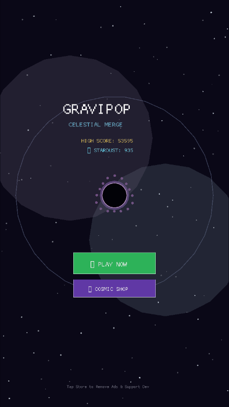

# 🌌 GraviPop: Celestial Merge

> **A high-performance hybrid-casual mobile game built entirely in Rust** — zero Unity, zero GC pauses, zero startup bloat.

Orbital physics merge game around a central Cosmic Singularity with tactile slingshot aiming, 10 celestial tiers, nuclear fusions, ascending audio harmonics, and an Event Horizon danger countdown.

---

## 🎮 Game Overview

| Feature | Details |
|---------|---------|
| **Engine** | Custom Rust game engine (Macroquad 0.4) |
| **Platforms** | Android (ARM64), Desktop (Windows/Mac/Linux) |
| **Genre** | Hybrid-casual / Merge / Physics |
| **Monetization** | Rewarded Ads + IAP (Remove Ads, Stardust Packs, Celestial Pass) |
| **APK Size** | ~8.2 MB debug |

### Core Gameplay Loop
1. **Slingshot** a celestial body (Stardust → Neutron Star → Black Hole) from the launch bay
2. **Merge** same-tier bodies when they collide to form higher-tier objects
3. **Survive** the Event Horizon — if too many bodies overflow the singularity zone, you lose
4. **Score** by chaining combos, earning Stardust, and climbing the 10-tier hierarchy

---

## 🚀 Quick Start: Desktop

### Prerequisites
- [Rust](https://rustup.rs/) (stable, 1.70+)
- Windows, macOS, or Linux

### Run on Desktop
```powershell
git clone <repo>
cd gravipop-mobile
cargo run
```

The game window opens at 450x800 (portrait, resizable).

---

## 📱 Building the Android APK

### Prerequisites

| Tool | Version | Notes |
|------|---------|-------|
| Rust | 1.70+ | `rustup target add aarch64-linux-android` |
| Android SDK | API 34 | C:\Users\<you>\AppData\Local\Android\Sdk |
| Android NDK | 28.2.x | Via SDK Manager |
| Java JDK | 21 | For Gradle |

### Step-by-Step Build

```powershell
# 1. Add the Android Rust target (one-time)
rustup target add aarch64-linux-android

# 2. Compile the Rust native library for ARM64
cargo build --target aarch64-linux-android --lib --release

# 3. Copy the compiled .so into the Android project
Copy-Item "target\aarch64-linux-android\release\libgravipop_mobile.so" "android\app\src\main\jniLibs\arm64-v8a\libgravipop_mobile.so" -Force

# 4. Build the APK with Gradle
$env:JAVA_HOME = "C:\Program Files\Java\jdk-21.0.11"
cd android
.\gradlew.bat assembleDebug

# 5. The ready-to-install APK is at:
# android\app\build\outputs\apk\debug\app-debug.apk
# (also copied to project root as gravipop-mobile.apk)
```

### Install on your Android device
```powershell
# Enable "Install from unknown sources" in Android Settings first
adb install gravipop-mobile.apk
```

Or copy gravipop-mobile.apk to your phone and tap to install.

---

## 🏗️ Project Architecture

```
gravipop-mobile/
├── src/
│   ├── main.rs                    # Desktop entry point (cargo run)
│   ├── lib.rs                     # Android cdylib entry point
│   ├── core/
│   │   ├── config.rs              # Virtual resolution, game constants
│   │   ├── game_state.rs          # State machine (MainMenu/Playing/GameOver/Shop...)
│   │   ├── save_system.rs         # JSON save/load (stardust, highscore, skins)
│   │   └── mod.rs
│   ├── physics/
│   │   ├── celestial_tier.rs      # 10-tier body type system
│   │   ├── body.rs                # CelestialBody struct (pos, vel, radius)
│   │   ├── gravity.rs             # Gravitational attraction engine
│   │   ├── collision.rs           # Merge detection + tier upgrade logic
│   │   └── mod.rs
│   ├── graphics/
│   │   ├── particles.rs           # Burst particle system for merges
│   │   ├── starfield.rs           # Procedural animated star background
│   │   ├── renderer.rs            # Celestial body draw (glow, rings, corona)
│   │   └── mod.rs
│   ├── audio/
│   │   ├── sound_synthesizer.rs   # In-memory 16-bit 44.1kHz WAV generator
│   │   └── mod.rs
│   ├── monetization/
│   │   ├── ads.rs                 # MockAdService + Android AdMob JNI hooks
│   │   ├── billing.rs             # MockBillingService + Play Billing stubs
│   │   ├── economy.rs             # Stardust pricing catalog, shop items
│   │   └── mod.rs
│   └── ui/
│       ├── hud.rs                 # In-game HUD (score, stardust, event horizon)
│       ├── game_over_modal.rs     # Game over screen with ad/restart actions
│       ├── shop_modal.rs          # Cosmic Shop (IAP + skin unlocks)
│       ├── mock_ad_overlay.rs     # Simulated rewarded ad overlay
│       └── mod.rs
├── android/
│   ├── app/src/main/
│   │   ├── AndroidManifest.xml
│   │   ├── java/com/gravipop/celestialmerge/
│   │   │   ├── MainActivity.kt    # NativeActivity + AdMob init
│   │   │   ├── AdMobHelper.kt     # Rewarded + interstitial ads
│   │   │   └── BillingHelper.kt   # Google Play Billing
│   │   └── jniLibs/arm64-v8a/    # Compiled .so goes here
│   └── build.gradle / settings.gradle
├── assets/
│   └── font.ttf                   # Arial TTF bundled for Unicode glyphs
├── Cargo.toml
└── gravipop-mobile.apk            # Latest debug APK
```

---

## 💰 Monetization

| Type | SKU | Trigger |
|------|-----|---------|
| Rewarded Ad | — | Event Horizon Revive (save run) |
| Rewarded Ad | — | 2x Stardust Multiplier |
| IAP | com.gravipop.removeads | Remove all ads |
| IAP | com.gravipop.celestialpass | Celestial Star Pass |
| IAP | com.gravipop.stardust.500 | 500 Stardust |
| IAP | com.gravipop.stardust.2000 | 2000 Stardust |

> Production setup: Replace the sample AdMob App ID in AndroidManifest.xml and test product IDs in BillingHelper.kt before publishing.

---

## 🧪 Running Tests

```powershell
cargo test
```

All 22 unit tests cover: tier merging, gravity, collision, economy pricing, save/load, UI action logic.

---

## 📸 Screenshots

### Main Menu


---

## 🛣️ Roadmap

- [ ] Production AdMob App ID + real ad units
- [ ] Google Play Console listing + signing key
- [ ] Haptic feedback on merge
- [ ] Leaderboard (Google Play Games)
- [ ] More celestial tiers (tier 11-14)
- [ ] Daily challenges system
