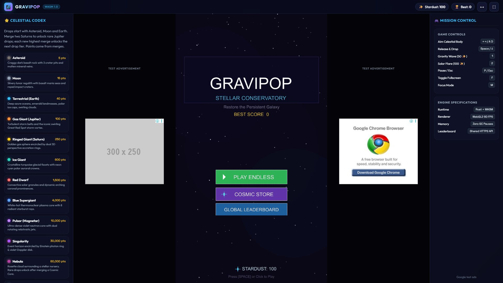
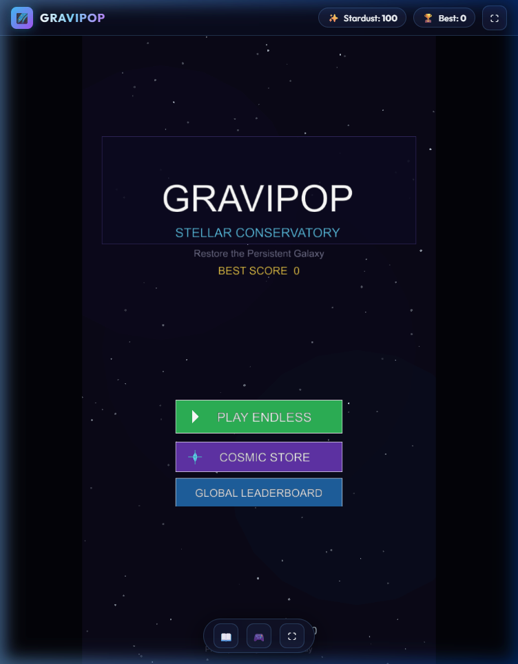
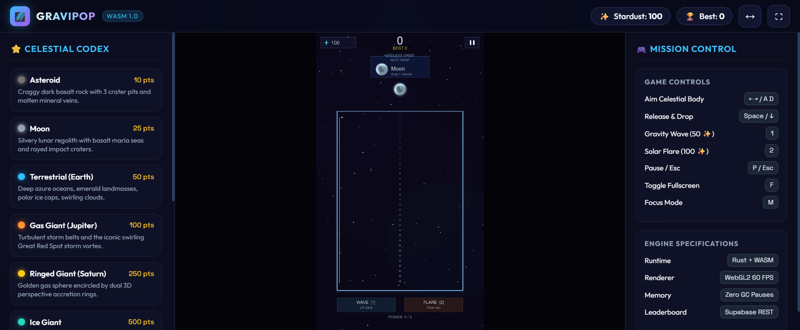
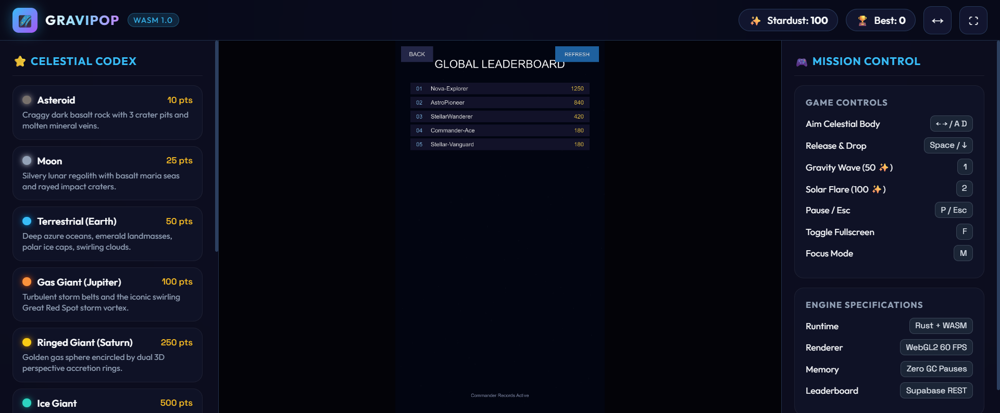

# GraviPop: Stellar Conservatory

A cosmic merge puzzle game built with Rust and Macroquad for the web, Android, and desktop.

**[Play GraviPop (Firebase Hosting)](https://gravipop-mobile.web.app)** · **[Play GraviPop (Vercel)](https://graviity-zeta.vercel.app/)** · [Game source](src/lib.rs) · [Android app](android/app) · [Shared leaderboard API](api/leaderboard.js)

## Recent updates
- **Official Firebase Web App Setup & High-Performance Firebase Hosting Deployment.**
  - **Firebase Project Context Linked:** Initialized `.firebaserc` configuring the active Firebase project `gravipop-mobile` in accordance with `firebase-basics` agent guidelines.
  - **Web App Registered:** Programmatically created and registered the Web App `gravipop-web` with App ID `1:763464770635:web:272b5f4de49c2682c559ce` in project `gravipop-mobile`.
  - **Modular Firebase Web SDK (`firebase.js`):** Integrated `firebase` modular v12+ SDK in `src/web/firebase.js` with active project configuration and browser-checked `getAnalytics()` integration; imported into `src/web/main.js`.
  - **Optimized WebAssembly Hosting Configuration (`firebase.json`):** Formatted production hosting for Vite `dist/` with dedicated `Content-Type: application/wasm` and `Cache-Control: public, max-age=31536000, immutable` headers for `.wasm` files to guarantee browser streaming compilation, along with font CORS headers and SPA rewrites.
  - **Production Deployment Verified:** Successfully deployed live to Firebase Hosting with CDN edge caching at **[gravipop-mobile.web.app](https://gravipop-mobile.web.app)** and **[gravipop-mobile.firebaseapp.com](https://gravipop-mobile.firebaseapp.com)**.
  - **Agent Skills Suite Installed:** Configured 13 official Firebase Agent Skills (`.agents/skills/`) and generated `skills-lock.json` for deterministic AI workflow reproducibility.
- **4K UHD Extreme Sharpness & Bold Typography Overhaul.**
  - **4K UHD Render Profile (2160 x 3840):** Added `ResolutionProfile::Extreme4K` in `src/core/config.rs` running a native 2160x3840 internal projection buffer, providing 4K monitors, high-DPI laptops, and OLED displays with crystal-clear 1:1 pixel rendering without bilinear upscaling blur.
  - **1080p Baseline Default (`HighDef`):** Promoted `ResolutionProfile::HighDef` (1080x1920) to the engine's default profile (replacing 720p `Standard`), ensuring full-HD crispness immediately upon first launch across modern laptops, desktops, and phones.
  - **Authentic Arial Bold Typography Upgrade:** Upgraded `assets/font.ttf`, `public/assets/font.ttf`, and `web/assets/font.ttf` to genuine **Arial Bold** (`arialbd.ttf`), replacing the previous thin Arial Regular. All glyphs now feature thick, confident, high-contrast stems that stand out vividly against deep cosmic backdrops.
  - **2x Supersampled Font Rasterization:** Implemented `raster_size = (size * 2.0).round()` with `font_scale: 0.5` across all text drawing functions (`draw_centered`, `draw_txt`, `dcx`, `dtx`, HUD indicators, and floating particles). Eliminates small-glyph upscaling blur by rasterizing glyphs into the font texture atlas at double pixel density.
  - **Hardware Bold Subpixel Strike:** Augmented text drawing with a subpixel horizontal strike (`+0.65px`) for extra typographic punch, high contrast, and crisp anti-aliased edge definition across all resolution profiles.
- **Pre-Generated Static Audio Assets & Zero-Latency Sound Loading.**
  - **Static WAV Sound Files Saved in Repo:** Generated and saved 11 static 44.1kHz mono PCM WAV files into `assets/audio/` and `public/assets/audio/` (`chime_0.wav` through `chime_7.wav` for pentatonic harmonic bell merges, `slingshot.wav` for release wooshes, `game_over.wav` for resonant low booms, and `click.wav` for tactile button taps).
  - **Compile-Time Binary Embedding (`include_bytes!`):** Refactored `AudioEngine` in `src/audio/sound_synthesizer.rs` to load audio buffers directly from embedded byte slices (`include_bytes!("../../assets/audio/...")`), completely eliminating sample-by-sample trigonometric synthesis math and heavy runtime vector allocations.
  - **Embedded Audio Validation Tests:** Added automated unit test `test_embedded_wav_files_are_valid` to verify RIFF/WAVE header integrity and PCM specifications across all 11 sound files.
- **Action Responsiveness & Render Loop Optimization (Lag Elimination).**
  - **Snappy Button Response (100ms Debounce):** Reduced `BUTTON_LOCK_DELAY` from 350ms to 100ms (`0.10s`). Combined with touch-release safety gating, buttons and menu selections respond immediately with zero perceptible hang or stutter.
  - **Cached Particle Glyph Widths:** Added pre-computed `width` caching to `FloatingText` in `src/graphics/particles.rs`, eliminating repetitive per-frame TTF `measure_text` calculations for active floating merge popups (`+100`, `+250`).
- **Pause Menu Settings & Display Access Mid-Run.**
  - **In-Game Settings Button:** Added a dedicated `SETTINGS & AUDIO` glassmorphic button to the Pause Menu (`GameState::Paused`), allowing players to adjust sound effects, haptic toggles, and hardware resolution profiles mid-game without forfeiting or ending active runs.
  - **Procedural Vector Gear Icon:** Implemented `draw_vector_gear` in `src/graphics/icons.rs` to render a clean, transparent mechanical cog next to settings options, replacing any missing Unicode glyphs.
  - **Seamless Pause Continuity:** Returning from the Settings modal via "SAVE & BACK" or the Escape key returns smoothly to the paused session, preserving all live celestial bodies, velocities, danger timers, and particles.
- **Audio Mute State Synchronization & Total Silence When Off.**
  - **Runtime Engine State Sync:** Fixed a bug where toggling sound off in Settings (`SOUND: MUTED`) did not silence audio because `AudioEngine` was never synchronized with `save_data.sound_enabled` on boot or upon clicking toggle.
  - **100% Mute Enforcement:** Added `AudioEngine::set_sound_enabled()` and synchronized it both on startup and immediately upon user toggle. When sound is muted, all audio synthesizers (bell chimes, slingshot woosh, low boom, and button clicks) are immediately and completely silenced.
- **Audio Engine Activation & Procedural Tactile Click Synthesis.**
  - **Macroquad Audio Feature Enabled:** Updated `Cargo.toml` to declare `macroquad = { version = "0.4", features = ["audio"] }`. Eliminates the missing audio feature flag that previously emitted over 3,600 `warn: macroquad's "audio" feature disabled.` console warnings and prevented all sound effects from playing.
  - **Zero-Latency Sound Synthesis:** Procedurally synthesized bell chimes, slingshot wooshes, and low boom sounds now play flawlessly on native desktop (`quad-snd` / `hound`) and web (`Web Audio API` in `mq_js_bundle.js`).
  - **Interactive Tactile Click Sound:** Added a dedicated procedural `play_click()` synthesizer in `AudioEngine` (880Hz decaying pulse) providing crisp, tactile auditory feedback whenever players interact with main menu buttons, modal tabs, or toggles.
- **Razor-Sharp Typography & Text Readability Overhaul.**
  - **Emoji Glitch Elimination:** Replaced raw Unicode emojis (`⭐`, `⚙️`, `🏆`, `✨`, `⏸`) in `src/lib.rs` with clean typography and custom procedural vector icons (`draw_vector_star`, `draw_vector_gem`, vector play). Eliminates broken tofu rectangles (`[?]`) and multi-byte glitched boxes caused by variation selectors (`\u{fe0f}`).
  - **Guaranteed Embedded Font Loading:** Switched from asynchronous file-path loading (`load_ttf_font("assets/font.ttf")`) to synchronous embedded binary loading (`load_ttf_font_from_bytes(include_bytes!("../assets/font.ttf"))`). Eliminates any risk of runtime path failures or asynchronous delays that previously caused Macroquad to fall back to the illegible, pixelated 8x8 default bitmap font.
  - **Crisp Floating Merge Popups:** Updated `ParticleEngine::draw` to accept the loaded font and render floating merge points (`MERGE +100`, `+250`) with soft drop shadows, replacing the blurry 8x8 bitmap font.
  - **Paginated Achievements Modal:** Replaced the cramped 18-item vertical stack with a clean, 3-page paginated carousel (7 items per page with `< PREV` and `NEXT >` buttons and page counter). Eliminates the severe layout collision where the bottom achievements previously rendered right on top of the "DONE / BACK" button.
  - **High-Contrast Text Hierarchy:** Boosted font sizes (from 12–14px to 15–20px) and upgraded text colors across `AchievementsModal`, `SettingsModal`, `ShopModal`, and `GameOverModal` to high-contrast luminances for effortless readability on dark glassmorphic backdrops.
  - **Sub-Pixel Antialiasing Rounding:** Added integer rounding (`.round()`) across all text helpers (`draw_centered`, `draw_txt`, `dcx`, `dtx`), preventing sub-pixel rasterization blurriness in Macroquad.
  - **540x960 Desktop Window Default:** Increased desktop window dimensions from 450x800 to 540x960 (standard 9:16 portrait), giving a 20% larger display scale and crisper glyph rasterization on modern 1080p and 1440p monitors.
- **Polished Glassmorphic Powerup System & Super Solar Flare (`[3]`).**
  - **Super Solar Flare (Tier 3 Clear):** Introduced a 3rd powerup that clears the board of micro-debris by instantly vaporizing all celestial bodies strictly below Earth level (`tier < CelestialTier::Terrestrial`, eliminating Asteroids and Moons).
  - **Milestone Charge Accumulation:** Super Solar Flare is earned through gameplay skill by accumulating 50,000 score per charge (`SUPER_FLARE_SCORE_INTERVAL = 50,000`). It stores a maximum of 2 charges (`MAX_SUPER_FLARE_CHARGES = 2`), tracked on an independent sun-pip meter with a live fractional score gauge.
  - **Buffed Gravity Wave (`[1]`) with Overflow Immunity:** Increased central gravitational attraction (`1.6x`) and vertical pop impulse (`-280px/s`). While active, grants 3.5s of overflow immunity (`GRAVITY_WAVE_GRACE_DURATION = 3.5`), clearing accumulated danger and skipping overflow checks during orbital compression.
  - **Polished HUD Bar:** Redesigned powerup buttons with cosmic glassmorphism, glowing inner and outer borders, specular top-arc highlights, hotkey tags (`[1]`, `[2]`, `[3]`), and dual charge meters.
- **Physics Overflow Bug Fixes & Drop-Transit Immunity.**
  - **Drop Transit Immunity & Wall-Contact Fix:** Introduced `in_drop_transit` lifecycle tracking on `CelestialBody`. Newly dropped bodies falling from the top dispenser are explicitly marked in transit and never trigger overflow alerts, even when sliding along or bouncing off side walls. Transit status clears only once the body's entire radius passes below `JAR_TOP_LINE` or makes physical collision contact with bodies in the jar or the floor.
  - **Wall-Pinned Overflow Precision:** Settled bodies stacked at jar edges that vibrate horizontally against walls (due to restitution impulses) are accurately detected as overflowing by verifying low vertical velocity (`|vel.y| < 40px/s`) while resting above `JAR_TOP_LINE`.
  - **Unfrozen Danger Recovery:** Removed flawed proximity gates that previously locked the countdown timer when fresh planets passed near the rim, ensuring danger drains smoothly whenever no settled bodies breach the jar.
- **In-Game Settings & Hardware Display Profiles.**
  - **Dynamic Resolution Profiles:** Added customizable rendering profiles: 540p Power Saver (Mobile battery saver), 720p Standard (Recommended for mobile & low-end GPUs), 1080p Full HD (High refresh rate laptops & desktops), and 1440p Ultra (Flagship desktop displays).
  - **Hardware Recommendation Badges:** Provides device guidance badges for low-power mobile, balanced, and high-end discrete GPUs.
  - **Sound & Haptics Toggles:** Interactive vector toggles with persisted state in `SaveData`.
- **Cosmic Achievements System (Up to 1,000,000 Points & 13 Tiers).**
  - **Score Milestones:** Tracks achievements for reaching 10k, 25k, 50k, 100k, 250k, 500k, 750k, and 1,000,000 points.
  - **Full Celestial Tier Merges:** Evaluates and unlocks badges for merging every celestial body across all 13 tiers from Asteroid up to the apex Cosmic Core.
  - **Polished Modal Interface:** Scrollable list with cosmic glowing badges, completion percentages, unlock timestamps, and gold milestone stars.
- **Web Codex Celestial Atlas Visuals.**
  - **Direct Atlas Portraits:** Integrated authentic celestial illustrations for tiers 1 through 10 directly cropped from `assets/celestial_atlas.jpg`.
  - **Apex High-Res Spheres:** Generated and integrated matching spherical game assets for Nebula (Tier 11), Quasar (Tier 12), and Cosmic Core (Tier 13).
  - **Interactive Glow & Zoom:** Styled codex cards in `src/web/style.css` with radial gradient backdrops, tier-colored glowing borders, and smooth hover micro-animations.
- **Shop Button Migration.**
  - Removed the shop button from the Main Menu and Game Over modal per design specifications, while keeping all underlying shop data structures, catalog items, and billing integrations completely intact in the codebase.
- **Case-Sensitive Global Leaderboard Names.**
  - **Preserves Exact Casing:** Player callsigns with different capitalization (e.g. `areeb`, `Areeb`, and `AREEB`) are treated and stored as distinct identities on the global shared leaderboard.
  - **Exact String Indexing:** Removed `.toLowerCase()` key flattening in `api/leaderboard.js`. Both deduplication maps, personal best comparison lookups, and score deletion endpoints now match exact character sequences.
- **Merge Contact Priority Over Physics Nudges.**
  - **Connection-First Fusion:** Refactored `CollisionEngine::resolve_collisions` in `src/physics/collision.rs` so that connecting bodies of the same tier are checked and merged *first* before any collision passes or impulse calculations are processed.
  - **Equal-Tier Nudge Elimination:** Strictly guarded the unstable equilibrium break nudge with `a.tier != b.tier && top_radius > bottom_radius * 1.15`. Two planets of the same tier are never nudged or deflected sideways.
  - **Equal-Tier Roll-Off Suppression:** Restricted curvature roll-off torque to `a.tier != b.tier`, allowing newly merged planets and dropped planets to connect and fuse smoothly without sliding apart.
  - **Secondary Fusion Pass:** A second fusion check executes after positional separation passes to catch planets brought together during solver iterations.
- **Mid-Screen 5.0-Second Overflow Countdown Timer & HUD Alert.**
  - **5-Second Grace Window:** Replaced instantaneous game-over triggers with an active 5.0-second countdown (`DANGER_TIME = 5.0` in `src/core/config.rs`).
  - **Dynamic Recovery Loop:** In `src/lib.rs`, `danger_timer` accumulates only while settled bodies breach `JAR_TOP_LINE`. If the player fuses overflowing planets or uses an ability to lower the stack, danger clears and the timer smoothly decays back to 0.0s.
  - **Pulsing Mid-Screen Warning Display:** In `src/ui/hud.rs`, when overflow danger begins, an animated dark crimson HUD badge displays right at the overflow rim line (`y = 365.0`) with pulsing neon borders, live countdown text (`OVERFLOW IN 4.8s`), and an animated draining progress bar.
- **Global Leaderboard Score Deletion & Duplicate Username Handling.**
  - **Try-Catch Existing Username Protection:** When submitting a score (`submitGlobalScore`), a `try...catch` block inspects current global entries. If a matching username (case-insensitive) already exists, it compares scores: lower scores will not downgrade the player's recorded personal best, while higher scores overwrite the existing entry and clean up stale duplicates in Dreamlo.
  - **Case-Insensitive Deduplication:** `fetchGlobalLeaderboard` filters and groups all entries by canonical username, guaranteeing each player holds exactly one leaderboard slot with their highest achieved score.
  - **Score Deletion Endpoints & CLI Management:** Added a `DELETE /api/leaderboard?name=<username>` and `DELETE /api/leaderboard?clear=all` API route, plus terminal commands (`npm run leaderboard:list`, `npm run leaderboard:delete -- <name>`, `npm run leaderboard:clear`) via `scripts/manage-leaderboard.mjs` to easily manage or prune scores.
- **Mobile Screen Transition Touch Release Guard & Cross-Screen Click Bleed Elimination.** Fixed the mobile-specific touchscreen bug where tapping a button on one screen immediately clicked whatever button was underneath on the destination screen:
  - **Touch Contact Only (`tap = mouse_pressed || touch_started`):** Removed `touch_ended` from `tap` generation. On touchscreens, lifting a finger emits a release event (`TouchPhase::Ended`), which previously synthesized a second tap if the finger remained held down past the debounce cooldown.
  - **Immediate Same-Frame Tap Consumption:** Consumed `ui_tap = false` the instant any button or modal action fires during game logic, completely preventing the subsequent render pass from evaluating the tap against newly displayed modal buttons (e.g. Pause "End Run" directly overlapping GameOver "Play Again" in the same 0ms frame).
  - **Clean Touch Release Gate (`require_touch_release`):** Any screen transition or modal change locks all interaction until the user has physically lifted their finger off the screen (`!is_held`). Fingers held across transitions cannot accidentally trigger button presses or start unintended planet aiming/drops upon entering the gameplay screen.
- **Fixed Store Return Navigation (`shop_return_state`).** Resolved the issue where closing the Cosmic Store after finishing a game would send the player back to the Game Over screen instead of the Main Menu:
  - Replaced the flawed heuristic (`if current_score > 0 { GameOver } else { MainMenu }`) with explicit return routing via `shop_return_state`.
  - Opening the store from Main Menu cleanly returns to Main Menu upon closing, while opening from Game Over returns to Game Over.
  - Reset `current_score = 0` and `run_stardust = 0` whenever returning home from completed runs.
  - Added "SKIP & RETURN HOME" on Game Over when no callsign is entered, allowing frictionless return to the Main Menu without requiring online leaderboard submission.
  - Expanded the touch hit area for the Store close button and added Escape / Android Back button support.
- **Universal Button Click Lock Delay & Debouncing.** Implemented a 350ms button lockout cooldown (`BUTTON_LOCK_DELAY = 0.35`) in the Macroquad game loop. Eliminates rapid double-click issues, ghost clicks from dual touch-started/touch-ended events, and cross-screen click bleed when navigating between screens.
- **Official Android App Launcher Icons.** Transcoded official launcher and adaptive/round launcher icons across `mipmap-mdpi`, `hdpi`, `xhdpi`, `xxhdpi`, and `xxxhdpi` from `assets/gravipop_icon.jpg`, binding `@mipmap/ic_launcher` and `@mipmap/ic_launcher_round` in `android/app/src/main/AndroidManifest.xml`.
- **Resolved NDK Deprecation Warning [CXX5106].** Cleaned deprecated `ndk.dir` from `android/local.properties`. Gradle builds now configure native compilation directly through `android.ndkVersion = '28.2.13676358'` in `android/app/build.gradle` without deprecation notices.
- **Top & Bottom Mobile Letterbox Ads.** For modern ultra-tall mobile viewports (19.5:9 / 20:9) where the 9:16 game canvas leaves vertical letterbox margins at the top and bottom, added dynamic `#ad-rail-top` and `#ad-rail-bottom` banner ad slots in `web/gravipop_ads.js`, `index.html`, and `src/web/style.css`.
- **Mobile Soft Keyboard Stability & No Resize.** Eliminated laggy canvas resizes and viewport distortions when opening the on-screen keyboard to enter player callsigns:
  - Android: Configured `android:windowSoftInputMode="adjustNothing|stateHidden"` and `keyboard|keyboardHidden` in `AndroidManifest.xml` to lock `SurfaceView` dimensions during text entry.
  - Web: Configured meta viewport with `interactive-widget=overlays-content` and `viewport-fit=cover` in `index.html` and `web/index.html`.
- **Pause Menu End-Run Score Upload Prompt.** Ending a run early from the Pause Menu now routes directly to the End Run / Score submission screen whenever `current_score > 0`, prompting players to record their name/callsign and stardust earnings instead of silently discarding run achievements.
- **Polished Cosmic Glassmorphism UI.** Completely revamped the Main Menu and Pause screens in `src/lib.rs` with glowing dual-border obsidian cards, title drop-shadows, all-time best stat badges, and styled pill buttons ("Play Endless", "Cosmic Store", "Leaderboard", "Resume Flight", "End Run & Submit Score").
- **Resolved PDB output filename collision.** Renamed the desktop binary target to `gravipop-desktop` in `Cargo.toml` and build scripts, eliminating the Cargo 1.97 warning on Windows MSVC where `gravipop-mobile` (bin) and `gravipop_mobile` (lib) collided on `gravipop_mobile.pdb`.
- **Verified modern Android APK pipeline.** Documented why `cargo quad-apk` panics on modern Rust toolchains (lockfile v4 and edition 2024 incompatibility in cargo 0.62) and validated the production-grade `npm run build:android` + Gradle workflow generating verified `app-debug.apk` (15.6 MB) with NDK 28.2.
- **One result-screen save action.** Game Over and Sector Complete center scores and rewards. **Save Score & Return Home** validates the callsign, saves progress, submits once, and returns home. The web textbox has no duplicate submit button; Enter uses the same action.
- **Merge-based drops.** Every new run starts with Asteroid, Moon, and Earth, weighted 60:30:10. Merging two Saturns into an Ice Giant adds Jupiter. Each new highest merged planet then adds the next drop tier. Score and historical best score never unlock drops.
- **Rare larger planets.** Jupiter starts at approximately 0.1% of drops, increasing to approximately 0.6% after 100 further merges. Each larger tier is rarer; all larger drops together remain below 2%. Unlocks reset on a new run and survive a revive. Quasar and Cosmic Core are merge-only.
- **Merge-only points.** Drops and landings award no points. Score popups explicitly say **MERGE +…**, and every planet tier has a regression check for landing without scoring.
- **Real ads.** Google Publisher Tag supplies web rewarded ads, interstitials, and two responsive sidebar placements. Android uses Google's Next-Gen Mobile Ads SDK. Rewards require its earned-reward callback and are granted once after closing; cancellations and failures grant nothing.
- **Shared leaderboard on every build.** Web, Android, and desktop use the same API. Native HTTPS requests run on a background worker; Android supports callsign keyboard input and saves in app-private storage.
- **Reliable Android builds.** The Rust library is compiled with NDK 28.2, then packaged by Gradle with the matching Miniquad Java host and ad SDK. This replaces the outdated cargo-quad-apk workflow that rejects version-4 Cargo.lock files.
- **Vercel Analytics.** The Vite entry point initializes the official analytics client once.

## Screenshots

These are real browser captures. Google demo inventory is labeled as test advertising and does not earn revenue.

| Desktop with Google test ads | Mobile layout |
| :---: | :---: |
|  |  |

| Gameplay | Shared leaderboard |
| :---: | :---: |
|  |  |

## Clone and prerequisites

~~~powershell
git clone https://github.com/AREEB-AZHAR/gravipop-mobile.git
cd gravipop-mobile
~~~

| Tool | Requirement |
| :--- | :--- |
| Node.js | 22+ recommended; package requires 18+ |
| Rust / Cargo | Current stable; checked with Rust 1.97.1 |
| Web target | wasm32-unknown-unknown when rebuilding game code |
| Windows desktop compiler | Visual Studio Build Tools, Desktop development with C++ |
| Android only | SDK platform 36, Build Tools 35.0.0, NDK 28.2.13676358, JDK 21 |

~~~powershell
rustup update stable
rustup target add wasm32-unknown-unknown
npm ci
~~~

Compiled web assets are included, so Rust is unnecessary for running the existing web build. Install Rust to edit or rebuild the game. Linux desktop builds also need the platform libraries documented by [Macroquad](https://github.com/not-fl3/macroquad).

## Web development and deployment

~~~powershell
npm run dev
~~~

Open **http://localhost:3000**. Vite serves the shell and local leaderboard API middleware. JavaScript/CSS changes reload during development. After editing Rust, run **npm run build:wasm** and reload the page.

~~~powershell
npm run build:all  # Rust WASM, bridge files, then Vite production bundle
npm run preview   # Static preview at http://localhost:8080
~~~

Static preview has no local API middleware. Use the dev server to test API changes, or set VITE_LEADERBOARD_URL to the production API before building a static preview.

Vercel runs **npm run build**, consuming the committed binary in public/ without installing Rust. Rebuild and commit that binary when Rust changes. Pushing master triggers the linked project's deployment. Vercel hosts /api/leaderboard and Web Analytics; visit the deployed site to generate analytics traffic.

For static-only hosting, copy .env.example to .env.local and set:

~~~dotenv
VITE_LEADERBOARD_URL=https://graviity-zeta.vercel.app/api/leaderboard
~~~

Run npm run build after changing VITE_ variables, then deploy dist/.

## Android APK build — PowerShell

Install JDK 21, Rust, Node, and Android Studio. In SDK Manager install **Android SDK Platform 36**, **Build-Tools 35.0.0**, and **NDK (Side by side) 28.2.13676358**. The project supplies Gradle 8.14 and Android Gradle Plugin 8.10.0.

Use JDK 21 for this wrapper. Android Studio's bundled JBR can be Java 25, which Gradle 8.14 cannot run with. Set JAVA_HOME explicitly. These paths match this development machine; adjust them on another computer.

~~~powershell
$env:JAVA_HOME = "C:\Program Files\Java\jdk-21.0.11"
$env:ANDROID_HOME = "$env:LOCALAPPDATA\Android\Sdk"
$env:NDK_HOME = "$env:ANDROID_HOME\ndk\28.2.13676358"
rustup target add aarch64-linux-android
npm run build:android
Push-Location android
.\gradlew.bat :app:assembleDebug --console=plain
Pop-Location
~~~

**Installable APK:** android/app/build/outputs/apk/debug/app-debug.apk. It is automatically debug-signed and uses official Google test ads. Install on an arm64 Android 7.0+ phone, or use:

~~~powershell
& "$env:ANDROID_HOME\platform-tools\adb.exe" install -r "android\app\build\outputs\apk\debug\app-debug.apk"
~~~

Gradle locates the SDK from ANDROID_HOME. Alternatively create ignored android/local.properties with your SDK path, such as sdk.dir=C:/Users/areeb/AppData/Local/Android/Sdk. Do not commit local SDK paths or signing credentials.

For an x86_64 emulator, compile matching Rust targets and set matching Gradle ABI filters:

~~~powershell
rustup target add aarch64-linux-android x86_64-linux-android
npm run build:android -- --abis=arm64-v8a,x86_64
Push-Location android
.\gradlew.bat :app:assembleDebug -Pgravipop.abis=arm64-v8a,x86_64
Pop-Location
~~~

For a store bundle, run :app:bundleRelease and configure your own release signing in Android Studio. Release artifacts are unsigned until signing is configured. APKs, bundles, local SDK paths, and build directories are ignored by Git.

### Why `cargo quad-apk` Fails & How the Gradle Pipeline Works

Running `cargo quad-apk build --release` fails on modern Rust and Android toolchains due to two upstream limitations:
1. **Cargo 0.62 Parser Lockout:** `cargo-quad-apk` 0.1.4 (published in 2022) embeds and links against the ancient `cargo = "0.62.0"` crate. Modern Cargo 1.78+ generates `Cargo.lock` with `version = 4`. When `cargo-quad-apk` attempts to resolve the workspace to locate Miniquad's Java files, its internal 2022 parser panics (`lock file version 4 was found, but this version of Cargo does not understand this lock file`).
2. **Rust Edition 2024 Panics:** Even if the lockfile is temporarily modified to `version = 3`, modern transitive dependencies in the Rust ecosystem (e.g., `icu_locale_core` pulled transitively by HTTPS/TLS crates) use `edition = "2024"`. The internal Cargo 0.62 parser panics again with `this version of Cargo is older than the '2024' edition, and only supports '2015', '2018', and '2021' editions`.
3. **NDK 28 Toolchain Structure:** `cargo-quad-apk` expects older NDK (r21–r25) standalone binary conventions, whereas NDK 28 on Windows uses `.cmd` script wrappers (e.g. `aarch64-linux-android24-clang.cmd`).

**The Solution (`npm run build:android` → Gradle):**
Instead of invoking `cargo-quad-apk`, use the production Gradle build:
- `scripts/build-android.mjs` automatically inspects `miniquad`'s manifest via `cargo metadata`, extracts Miniquad's Java host files (`QuadActivity.java`, `QuadNative.java`), configures the NDK 28 Clang cross-compilation environment variables, compiles the `libgravipop_mobile.so` shared library with 16 KB ELF page alignment (required by Android 15), and places it in `android/app/src/main/jniLibs/arm64-v8a/`.
- Gradle (`.\gradlew.bat :app:assembleDebug`) then packages the APK with Android SDK 36, Google Mobile Ads SDK, and Miniquad native activity, outputting the verified installable APK: `android/app/build/outputs/apk/debug/app-debug.apk`.

### PDB Output Filename Collision Resolution
In Cargo, dashes (`-`) are normalized to underscores (`_`) when generating `.pdb` debug symbol files on Windows MSVC. Having a binary target `gravipop-mobile` alongside a library target `gravipop_mobile` caused both to emit `gravipop_mobile.pdb` in `target/debug/deps/`, triggering a compiler collision warning. Renaming the binary entry point to `gravipop-desktop` in `Cargo.toml` cleanly separates the two build artifacts and resolves all collision warnings.

## Ads: test now, live after publisher setup

No production ad IDs have been supplied. The game uses **actual SDK-served Google test ads**, which generate no income. Native desktop builds have no ad provider; rewarded actions remain unavailable there.

### Website

Copy .env.example to .env.local. VITE_ADS_MODE accepts **test** (default), **off**, or **live**.

~~~dotenv
VITE_ADS_MODE=test
VITE_GOOGLE_AD_REWARDED_UNIT=
VITE_GOOGLE_AD_INTERSTITIAL_UNIT=
VITE_GOOGLE_AD_SIDEBAR_LEFT_UNIT=
VITE_GOOGLE_AD_SIDEBAR_RIGHT_UNIT=
~~~

Live mode requires your own **Google Ad Manager ad-unit paths**, such as /NETWORK_CODE/UNIT_NAME, rather than AdMob IDs or an AdSense publisher ID. Configure rewarded and gaming-interstitial inventory in your account; the gaming interstitial format requires account access. Configure your publisher's consent message / certified CMP before live inventory and include its generated tag in index.html. Android UMP does not manage website consent.

Add the VITE_ values in Vercel and redeploy. Missing live unit paths never fall back to Google's demo inventory.

Sidebar creatives appear only when they fit in empty margins beside the 9:16 game. They hide on narrow screens, failed/no-fill requests, and no-ads saves. They do not cover gameplay or mobile controls. Interstitials use the existing run interval; unavailable ads do not block results. Rewarded ads remain player-selected.

References: [rewarded web sample](https://developers.google.com/publisher-tag/samples/display-rewarded-ad), [gaming interstitial sample](https://developers.google.com/publisher-tag/samples/display-gaming-interstitial-ad), [publisher consent settings](https://support.google.com/admanager/answer/7673898).

### Android

The app uses **Next-Gen Mobile Ads SDK 1.5.0** and **User Messaging Platform 4.0.0**. Load/show/dismiss callbacks connect to Rust through JNI; each reward carries its original request ID.

Debug builds always use test inventory. Release builds also default to tests until ads.testMode=false and your own IDs are configured. Copy public values from android/ads.properties.example into android/gradle.properties:

~~~properties
ads.testMode=false
ads.appId=ca-app-pub-YOUR_PUBLISHER_ID~YOUR_APP_ID
ads.rewardedUnitId=ca-app-pub-YOUR_PUBLISHER_ID/YOUR_REWARDED_UNIT
ads.interstitialUnitId=ca-app-pub-YOUR_PUBLISHER_ID/YOUR_INTERSTITIAL_UNIT
~~~

The live build rejects missing or malformed IDs. Create and publish AdMob consent messages before enabling live mode. The app requests consent and loads ads only when UMP permits; **Ad Privacy** appears when privacy options are required. Preloaded ads expire before an hour; failed loads retry without trapping the game in a mock ad screen.

References: [Android SDK setup](https://developers.google.com/admob/android/next-gen/quick-start), [rewarded ads](https://developers.google.com/admob/android/next-gen/rewarded/single-load), [UMP integration](https://developers.google.com/admob/android/privacy).

In-app purchases still use the existing mock billing flow and are not production payment processing.

## Shared leaderboard

Default web, Android, and desktop builds read and submit to **https://graviity-zeta.vercel.app/api/leaderboard**. Web uses the relative route on that deployment; native builds use the absolute HTTPS URL. Vite development uses the same server handler. No database keys are required in game binaries.

The existing server-side Dreamlo provider stores global scores. Callsigns identify entries; use the same callsign across devices to share a leaderboard identity. This synchronizes scores, not local stardust/save files. Offline saves remain local; failed submissions are not silently retried.

GET returns an array of { display_name, high_score }; POST accepts those fields and returns { success, scores }. Provider failures report offline instead of invented global scores. The existing anonymous endpoint is not an anti-cheat system.

To use another deployment, set GRAVIPOP_LEADERBOARD_URL before compiling native Rust. Desktop also accepts it at runtime. Set VITE_LEADERBOARD_URL to the same API for web builds. The retained supabase/ migration is a separate backend option; shipped clients consistently use the shared API instead of a browser-only direct-Supabase path.

## Desktop and controls

~~~powershell
cargo run --release
~~~

Desktop saves to gravipop_save.json in the working directory. Android saves in its private files directory; web uses gravipop.save.v1 in localStorage.

| Action | Touch / mouse | Keyboard |
| :--- | :--- | :--- |
| Aim | Drag across jar / move mouse | Left / Right or A / D |
| Drop | Release | Space / Down |
| Gravity Wave | Tap button | 1 |
| Solar Flare | Tap button | 2 |
| Super Solar Flare | Tap button | 3 |
| Settings & Display | Tap button / Settings tab | Escape / S |
| Achievements | Tap Achievements button | A |
| Pause | Tap pause icon | P / Escape |
| Web fullscreen | Fullscreen button | F |
| Web focus mode | Focus button | M |
| Save finished score | Save Score & Return Home | Enter |

## Screenshots & Gallery

| Desktop with Google test ads | Mobile layout |
| :---: | :---: |
|  |  |

| Gameplay | Shared leaderboard |
| :---: | :---: |
|  |  |

> [!NOTE]
> **Recommended Community Screenshots:**
> To showcase the latest release, please capture and contribute the following screens to `docs/screenshots/`:
> 1. **Settings Modal (`settings_screen.png`):** Open *SETTINGS & DISPLAY* from the main menu showing the resolution profile choices (540p, 720p, 1080p, 1440p) and hardware badges.
> 2. **Cosmic Achievements Modal (`achievements_screen.png`):** Open *ACHIEVEMENTS* from the main menu displaying milestone badges up to 1,000,000 pts and completed tier fusions.
> 3. **HUD Powerups in Gameplay (`powerups_hud.png`):** A gameplay screen showing the polished glassmorphic 3-button powerup bar with the Super Solar Flare sun-pip gauge.
> 4. **Celestial Codex (`web_codex_atlas.png`):** The Web Codex tab showing the newly integrated portraits for all 13 celestial bodies.

## Validation

~~~powershell
cargo test --lib
npm run test:web
cargo test --lib deployed_global_leaderboard_is_readable_from_native_builds -- --ignored
~~~

The Rust suite has **30 unit tests** (29 passing, 1 optional production-HTTPS check). It covers physics, landing without scoring, drop unlocks/rarity, request-specific ad rewards, and the native API contract. Web checks cover single save events, ad lifecycle and placement, and leaderboard request ordering/offline handling.

The optional HTTPS check reads the production board without creating a score. Release WASM, Windows desktop, native arm64, and the Gradle debug APK are build-checked. Browser test creatives and the phone layout are visually verified. No Android device is currently attached for on-device ad testing.

Real Google web inventory was also checked manually: an early close returned no reward, a completed rewarded video returned one confirmed reward after closing, and a gaming interstitial opened and closed without a reward through the provider SDK.

## Architecture

~~~text
src/
  lib.rs                         Game loop, HUD powerups, modal orchestration and merge events
  core/
    achievements.rs              Milestone tracking (10k-1M pts, all 13 tiers)
    config.rs                    Resolution profiles, hardware hints, danger timers & powerup constants
    game_state.rs                State machine (MainMenu, Playing, Settings, Achievements, GameOver)
    leaderboard.rs               Shared client / polling
    leaderboard_native.rs        Native HTTPS background worker
    save_system.rs               Versioned progress (achievements, settings, high scores)
    sector.rs                    Campaign objectives
    web_bridge.rs                Miniquad web FFI
  physics/
    body.rs                      Celestial body dynamics, 0.05s overflow grace & rest detection
    celestial_tier.rs            13-tier merge chain (Asteroid through Cosmic Core)
    drop_pool.rs                 Per-run merge unlocks / weighted drops
    collision.rs                 Physics, boundary confinement and merge-only score events
  monetization/
    ads.rs                       Request-specific ad state
    ad_bridge.rs                 Web FFI / Android JNI
    billing.rs                   Cosmic shop & item catalog logic
  ui/
    achievements_modal.rs        Scrollable cosmic milestone list and badge rendering
    settings_modal.rs            Display resolution profiles, hardware recommendations, audio toggles
    game_over_modal.rs           Centered results, achievements shortcut and unified save
    shop_modal.rs                Cosmic store modal (preserved in engine)
    hud.rs                       Aim line, danger countdown alert badge, stats
    ad_overlay.rs                Paused backdrop during provider ads
  graphics/
    renderer.rs                  Body renderer, halo shaders, and tier visual effects
    starfield.rs                 Procedural parallax starfields & cosmic nebulae
  audio/                         Static embedded audio sound effects (chimes, woosh, boom, click)
  web/                           Vite UI, codex atlas viewer and styling
web/
  gravipop_web.js                 Storage, name input and leaderboard plugin
  gravipop_ads.js                 GPT fullscreen/sidebar lifecycle
public/
  assets/audio/                  11 static PCM WAV sound effects (chimes, slingshot, game over, click)
  assets/planets/                13 cropped & high-res celestial body portraits
api/leaderboard.js               Shared server-side handler
android/app/src/main/
  java/com/gravipop/celestialmerge/
    MainActivity.kt              Miniquad host and JNI callbacks
    AdMobHelper.kt               Next-Gen ads and UMP
  java/com/gravipop/runtime/      Generated Miniquad activity
  java/quad_native/              Miniquad JNI declarations
  jniLibs/arm64-v8a/              Native game library
scripts/
  generate-audio-files.mjs       Audio generator for static PCM WAV assets
  build-wasm.mjs                 WASM and public runtime sync
  build-android.mjs              NDK library and matching Java host
  test-*.mjs                     Bridge, ad and API checks
docs/screenshots/                Real captures
assets/
  audio/                         Static master 44.1kHz WAV sound files embedded at compile time
  celestial_atlas.jpg            Original 10-tier master illustrated sprite atlas
  planets/                       High-res cropped tier portraits (Tiers 1-13)
Cargo.lock                       Reproducible Rust dependency versions
vercel.json                      Vite deployment and WASM headers
.firebaserc                      Firebase active project mapping (gravipop-mobile)
firebase.json                    Firebase Hosting config, WASM MIME & immutable cache headers, rewrites
.agents/skills/                  13 official Firebase Agent Skills (Auth, Firestore, Hosting, Crashlytics, etc.)
skills-lock.json                 Agent skills lockfile for reproducible AI tooling
src/web/firebase.js              Modular Firebase SDK App & Analytics initialization
~~~

## Firebase Hosting & Web SDK Setup

The web version of GraviPop is deployed to **Firebase Hosting** with optimized WebAssembly headers and integrated Firebase Web SDK analytics.

### Prerequisites & Authentication
1. Verify the Firebase CLI via `npx`:
   ~~~powershell
   npx -y firebase-tools@latest --version
   ~~~
2. Authenticate with your Firebase account (browser or headless):
   ~~~powershell
   npx -y firebase-tools@latest login
   ~~~
3. Confirm active project is set to `gravipop-mobile`:
   ~~~powershell
   npx -y firebase-tools@latest use gravipop-mobile
   ~~~

### Local Build & Deployment
1. Install node dependencies (including `firebase`):
   ~~~powershell
   npm install
   ~~~
2. Build the production web bundle into `dist/`:
   ~~~powershell
   npm run build
   ~~~
3. Test locally with the Firebase Hosting emulator (optional):
   ~~~powershell
   npx -y firebase-tools@latest emulators:start --only hosting
   ~~~
4. Deploy live to Firebase Hosting:
   ~~~powershell
   npx -y firebase-tools@latest deploy --only hosting
   ~~~

### Live Deployments
- **Production URL:** [https://gravipop-mobile.web.app](https://gravipop-mobile.web.app)
- **Alternate URL:** [https://gravipop-mobile.firebaseapp.com](https://gravipop-mobile.firebaseapp.com)
- **Firebase Console:** [https://console.firebase.google.com/project/gravipop-mobile/overview](https://console.firebase.google.com/project/gravipop-mobile/overview)

