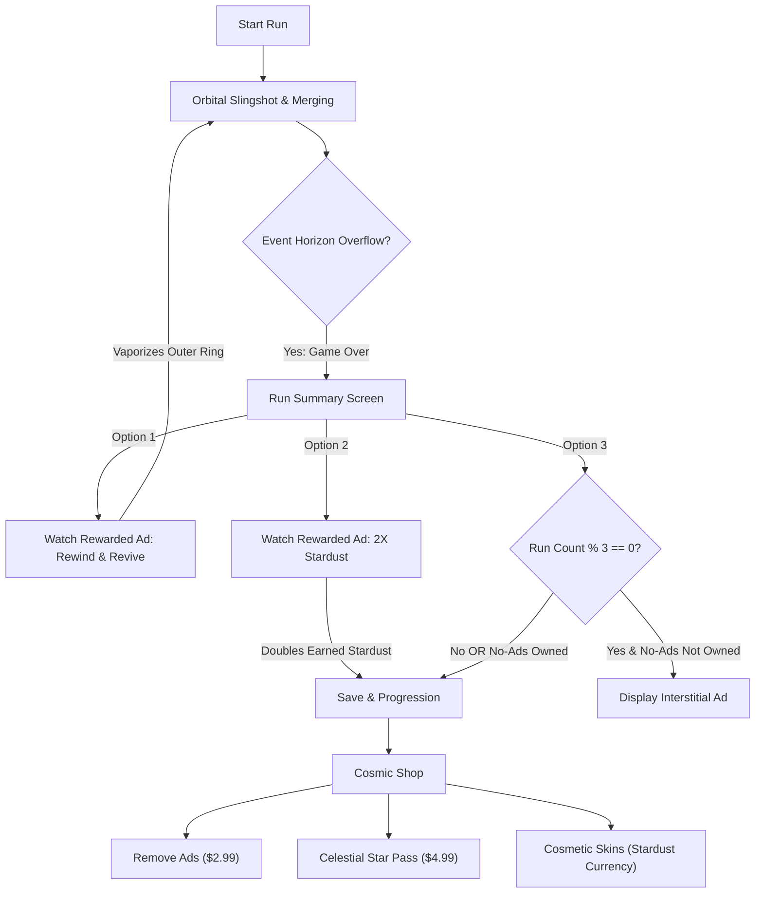

# 🌌 GraviPop: Celestial Merge

> **High-Performance Hybrid-Casual Mobile Game Engine & Game in Pure Rust**  
> *Deterministic Zero-Garbage-Collection Physics, Orbital Slingshot Mechanics, Procedural Synthesized Audio, and Built-In Hybrid Ad & Microtransaction Monetization.*

[](https://www.rust-lang.org/)
[](https://macroquad.rs/)
[]()
[]()

---

## 📖 Overview

**GraviPop: Celestial Merge** is a next-generation mobile hybrid-casual game engineered from the ground up in pure **Rust**. Designed as a high-efficiency alternative to heavyweight engines like Unity, GraviPop eliminates the runtime bloat, multi-second splash startup delays, and garbage collection stutter common in C# mobile runtimes.

Instead of traditional vertical match-3 or drop puzzles (*Suika Game*, *2048*), **GraviPop** features **dynamic orbital gravity mechanics**:
- Players sling celestial bodies into orbit around a glowing central **Cosmic Singularity (Black Hole)**.
- Matching celestial tiers collide, triggering explosive **Nuclear Fusions**, radial shockwaves, and harmonic musical chords.
- If the orbital perimeter overflows beyond the **Event Horizon**, a critical 4-second containment countdown begins before singularity collapse.
- Features a complete **Hybrid Monetization Architecture**: Rewarded Video Ads (Event Horizon Rewind continue, 2x Stardust multiplier), Non-Intrusive Interstitials, and In-App Purchases (No-Ads Pack, Celestial Star Pass, Currency Bundles) with an interactive desktop simulator.

---

## ⚡ Why Pure Rust + Macroquad over Unity & C++?

| Metric | Traditional Unity Mobile | GraviPop (Rust + Macroquad) | Advantage |
| :--- | :--- | :--- | :--- |
| **Cold Launch Time** | 3.5 – 6.0 seconds | **< 300 milliseconds** | **15x Faster Startup** |
| **Base APK Binary Size** | 35 MB – 65 MB+ | **~5 MB – 8 MB** | **85% Smaller Download** |
| **Garbage Collection (GC)**| Periodic pauses (5-20ms frame drops) | **Deterministic (0ms GC)** | **Buttery 60/120 FPS** |
| **Tooling & Setup** | Heavy Unity Editor & Hub (~10GB) | Lean `cargo` compiler & crates | **Zero Engine Bloat** |
| **Desktop Iteration Speed**| 30s – 1m domain reload | **< 2s `cargo run` build** | **Instant Dev Feedback** |

---

## 🏗️ Architectural Overview & File Structure

```
gravipop-mobile/
├── Cargo.toml                    # Engine manifest, release LTO optimizations, Android metadata
├── README.md                     # Comprehensive technical documentation & setup guide
├── .gitignore                    # Build artifact and OS exclusions
├── src/
│   ├── main.rs                   # Main game loop, virtual viewport scaling & input coordinator
│   ├── lib.rs                    # Android JNI shared library entry point & tests
│   ├── core/
│   │   ├── mod.rs
│   │   ├── config.rs             # Virtual 720x1280 resolution, physics constants & balancing
│   │   ├── game_state.rs         # State machine (MainMenu, Playing, Paused, GameOver, Shop, WatchingAd)
│   │   └── save_system.rs        # Serde JSON persistent storage (high score, stardust, IAP state)
│   ├── physics/
│   │   ├── mod.rs
│   │   ├── celestial_tier.rs     # 10 cosmic tiers (Asteroid to Singularity), colors & properties
│   │   ├── body.rs               # CelestialBody struct, mass, radius, velocity & rotation
│   │   ├── gravity.rs            # Central singularity attractor, inter-body pull & trajectory prediction
│   │   └── collision.rs          # Impulse resolution, momentum conservation & nuclear fusion
│   ├── graphics/
│   │   ├── mod.rs
│   │   ├── particles.rs          # Particle emitter engine & floating combo score multipliers
│   │   ├── starfield.rs          # Parallax drifting stars, cosmic nebulae & event horizon perimeter
│   │   └── renderer.rs           # Procedural atmospheres, craters, rings, flares & slingshot aiming
│   ├── audio/
│   │   ├── mod.rs
│   │   └── sound_synthesizer.rs  # In-memory WAV synthesizer (pentatonic bell chimes, woosh, boom)
│   ├── monetization/
│   │   ├── mod.rs
│   │   ├── ads.rs                # AdService trait & interactive desktop MockAdService simulator
│   │   ├── billing.rs            # BillingService trait & MockBillingService for IAP testing
│   │   └── economy.rs            # In-game store catalog (No Ads, Star Pass, Stardust, Skins)
│   └── ui/
│       ├── mod.rs
│       ├── hud.rs                # Glassmorphic top bar, combo gauge & danger overflow banner
│       ├── game_over_modal.rs    # Run summary, rewarded ad revive & 2x stardust actions
│       ├── shop_modal.rs         # In-game microtransaction store & cosmetic skin inventory
│       └── mock_ad_overlay.rs    # Interactive desktop video ad player with countdown & reward claims
└── android/                      # Android Studio Gradle Shell (NDK cdylib wrapper)
    ├── build.gradle              # Root Gradle build script
    ├── settings.gradle           # Root Gradle settings
    ├── gradle.properties         # JVM allocation & AndroidX settings
    └── app/
        ├── build.gradle          # AdMob SDK (23.3.0) & Google Play Billing SDK (7.1.1)
        └── src/main/
            ├── AndroidManifest.xml # Permissions, AdMob App ID & Fullscreen activity
            ├── res/values/strings.xml
            └── java/com/gravipop/celestialmerge/
                ├── MainActivity.kt # NativeActivity bridge & JNI native hooks
                ├── AdMobHelper.kt  # Rewarded video & interstitial ad handlers
                └── BillingHelper.kt# Google Play Billing Client 7+ integration
```

---

## 🎮 Celestial Merge Tier Hierarchy

When two identical celestial bodies collide, they undergo **Nuclear Fusion**, advancing to the next tier:

| Tier | Celestial Body | Radius | Mass | Score | Visual Characteristics |
| :---: | :--- | :---: | :---: | :---: | :--- |
| **0** | **Asteroid** | 18 px | 1.0 | 10 pts | Rocky slate gray with impact craters |
| **1** | **Moon** | 24 px | 2.2 | 25 pts | Pale cyan lunar silver with crater highlights |
| **2** | **Terrestrial** | 31 px | 4.5 | 60 pts | Azure ocean, emerald continents & cloud swirl |
| **3** | **Gas Giant** | 39 px | 9.0 | 150 pts | Vibrant amber and coral atmospheric storm bands |
| **4** | **Ringed Giant** | 47 px | 18.0 | 350 pts | Golden honey orb with orbiting elliptical ring system |
| **5** | **Ice Giant** | 55 px | 35.0 | 800 pts | Electric cyan crystalline ice facets |
| **6** | **Red Dwarf** | 64 px | 70.0 | 1,800 pts | Burning crimson flame with undulating coronal solar flares |
| **7** | **Blue Supergiant** | 74 px | 140.0 | 4,200 pts | Brilliant electric cobalt plasma with energetic arcs |
| **8** | **Pulsar** | 84 px | 280.0 | 9,500 pts | Dense violet sphere with spinning dual gamma ray beams |
| **9** | **Singularity** | 95 px | 600.0 | 25,000 pts | Void black core with iridescent swirling accretion disk |

---

## 💰 Monetization Architecture

GraviPop is designed for high retention and healthy LTV using a modern **Hybrid-Casual** monetization model:



### Desktop Mock Simulator
During desktop development on Windows, macOS, or Linux, `MockAdService` and `MockBillingService` render high-fidelity interactive modal overlays directly in the game window. Developers can test the full user flow (watching an ad countdown, collecting rewards, buying IAP products) without needing an active Android device or Google Play Console sandbox!

---

## 🚀 Getting Started & Local Setup

### 1. Prerequisites
- **Rust Toolchain**: Rust 1.80+ (Recommended: `rustc 1.97+`)
  ```powershell
  rustup update
  ```
- **Java Development Kit (JDK)**: JDK 17 or JDK 21 (for Android builds)
- **Android SDK & NDK**:
  - Android SDK (API 34+)
  - Android NDK (Version 25+ / 28+)

### 2. Running Locally on Desktop (Windows / Mac / Linux)
Clone the repository and run:
```powershell
cd C:\Users\areeb\Desktop\folders\gravipop-mobile

# Run the game in debug mode
cargo run

# Run with maximum release optimizations (60/120 FPS buttery smooth)
cargo run --release
```

### 3. Running Automated Tests
GraviPop includes an extensive unit test suite covering collision resolution, momentum conservation, celestial tier transitions, save data encryption/serialization, and mock ad/billing lifecycle:
```powershell
cargo test
```
*Output: 22 passed across library and binary targets.*

---

## 📱 Android Build & Packaging Guide

### Option A: Using `cargo-ndk` with Android Studio Gradle Shell (Recommended)
1. Install Android compilation targets:
   ```powershell
   rustup target add aarch64-linux-android armv7-linux-androideabi x86_64-linux-android
   ```
2. Install `cargo-ndk`:
   ```powershell
   cargo install cargo-ndk
   ```
3. Set your Android environment variables:
   ```powershell
   $env:ANDROID_HOME = "C:\Users\areeb\AppData\Local\Android\Sdk"
   $env:NDK_HOME = "C:\Users\areeb\AppData\Local\Android\Sdk\ndk\28.2.13676358"
   ```
4. Build the native shared libraries into the Android app's `jniLibs` directory:
   ```powershell
   cargo ndk -t arm64-v8a -t armeabi-v7a -o android/app/src/main/jniLibs build --release
   ```
5. Build the APK or App Bundle (AAB):
   ```powershell
   cd android
   ./gradlew assembleRelease
   ```
   The production APK will be output to: `android/app/build/outputs/apk/release/app-release-unsigned.apk`.

### Option B: Standalone APK with `cargo-quad-apk`
For rapid device side-loading:
```powershell
cargo install cargo-quad-apk
cargo quad-apk build --release
```

---

## 📸 Screenshots & Visual Inspection

> [!NOTE]
> When testing or running on your local device or emulator, please capture screenshots of the following screens to add to the visual gallery:
> 1. **Orbital Merge Gameplay**: Slingshot aiming with trajectory prediction dots curving into orbit around the central black hole.
> 2. **Nuclear Fusion Cascade**: Glowing particle burst and floating combo multiplier (`+500 x3 CASCADE!`) after matching celestial bodies fuse.
> 3. **Danger Zone Event Horizon**: Pulsing red perimeter warning with countdown timer.
> 4. **Cosmic Store & Mock Ad Overlay**: The in-game store showing In-App Purchases, Stardust skins, and the interactive mock video ad player.

---

## 📄 License
This project is open-source under the MIT License.
